# AeroPINN


Leveraging **Physics-Informed Neural Networks (PINNs)** to simulate airflow patterns around arbitrary airfoil geometries in real-time — replacing expensive CFD solvers with fast, physics-constrained deep learning.

[](https://www.python.org/)
[](https://www.tensorflow.org/)
[](https://streamlit.io/)
[](LICENSE)

---

## Problem

Traditional **Computational Fluid Dynamics (CFD)** simulations require mesh generation, boundary condition setup, and significant compute time for each airfoil design iteration. For engineers iterating over hundreds of designs, this becomes a bottleneck — both in time and cost.

<p align="center">
  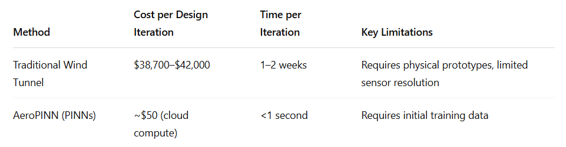
</p>

AeroPINN solves this by training a neural network that embeds the governing physics (Navier-Stokes equations) directly into the loss function, enabling **real-time predictions** of pressure and velocity fields around any NACA airfoil geometry.

## What is an Airfoil?

An airfoil is a streamlined shape designed to produce lift and minimize drag as air flows around it. The NACA 4-digit naming convention encodes the geometry:

<p align="center">
  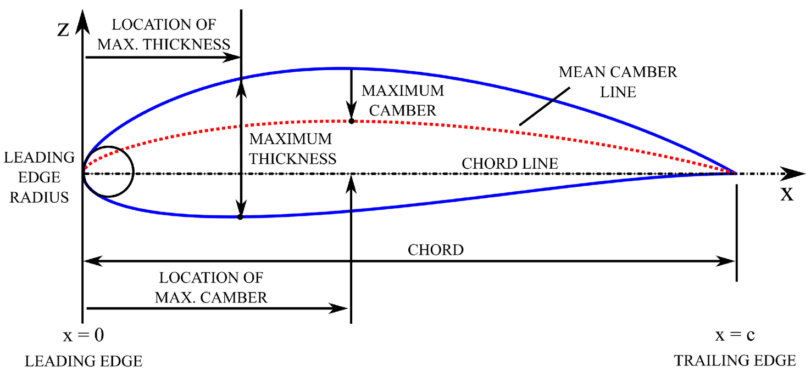
  <br><em>Airfoil geometry — leading edge, trailing edge, camber line, and thickness distribution</em>
</p>

## What are PINNs?

A standard neural network learns purely from data. A **Physics-Informed Neural Network** adds a second objective — the network must also satisfy the underlying physical laws.

<p align="center">
  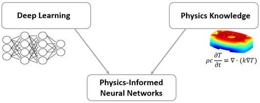
  <br><em>PINNs combine deep learning with physics knowledge</em>
</p>

The loss function has two components:

```
Total Loss = Data Loss + Physics Loss

Data Loss    →  |predicted - CFD ground truth|
Physics Loss →  Residuals of Navier-Stokes equations
                (Continuity: du/dx + dv/dy = 0)
```

The network takes spatial coordinates **(x, y)** as input and predicts flow variables **(u, v, p)** — velocity components and pressure. Automatic differentiation computes spatial derivatives to enforce physical consistency.

### Why Physics Matters — PINN vs Standard NN

The difference is striking. Without physics constraints, a neural network overfits to noise. With PINN, the model learns the true underlying trajectory:

<p align="center">
  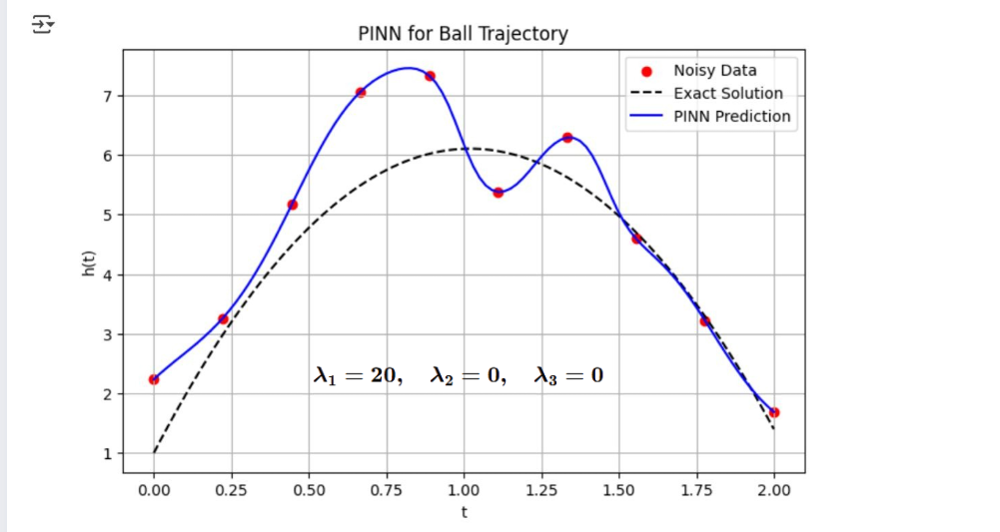
  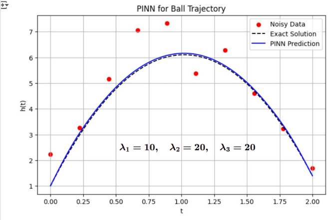
  <br><em>Left: Standard NN overfits noisy data | Right: PINN recovers the true trajectory</em>
</p>

## Architecture

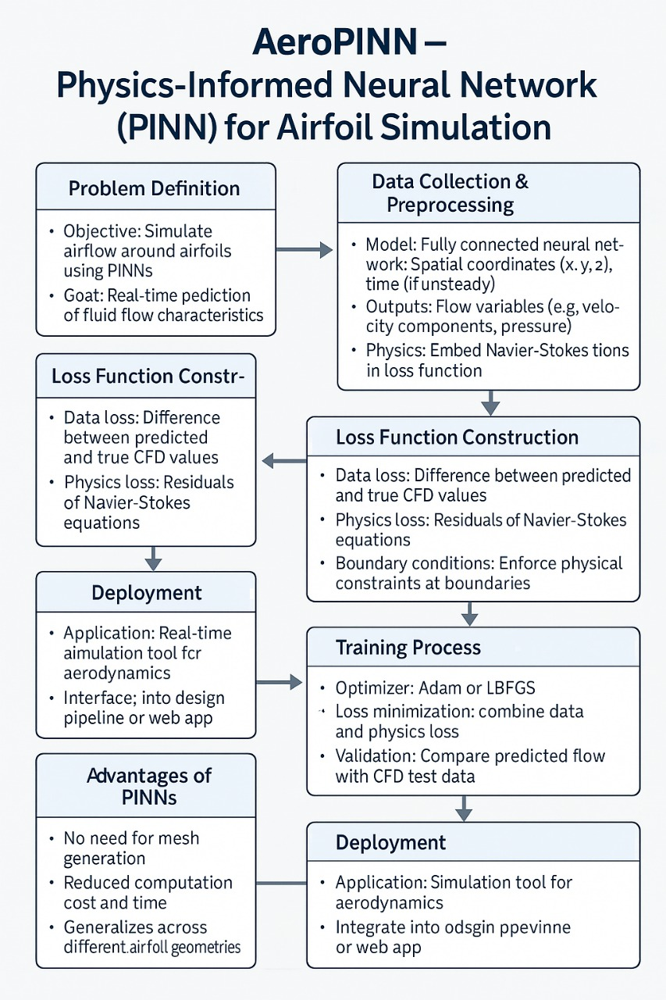

The pipeline follows:
1. **Data Collection** — CFD simulation results for 6 NACA airfoils (OpenFOAM)
2. **Preprocessing** — Coordinate extraction, normalization, missing data handling
3. **Loss Construction** — Data loss + Navier-Stokes residuals + boundary conditions
4. **Training** — Adam optimizer, 1000 epochs, combined loss minimization
5. **Deployment** — Streamlit web app for real-time inference

## Dataset

CFD simulation data for **6 NACA airfoil profiles**, each with ~1M data points:

| Airfoil | Type | Data Points | Fields |
|---------|------|-------------|--------|
| NACA 0012 | Symmetric | 999,000 | p, U:0, U:1, U:2, x, y, z |
| NACA 0015 | Symmetric | 999,000 | p, U:0, U:1, U:2, x, y, z |
| NACA 0021 | Symmetric | 999,000 | p, U:0, U:1, U:2, x, y, z |
| NACA 2412 | Cambered | 999,000 | p, U:0, U:1, U:2, x, y, z |
| NACA 2415 | Cambered | 999,000 | p, U:0, U:1, U:2, x, y, z |
| NACA 4412 | High Camber | 999,000 | p, U:0, U:1, U:2, x, y, z |

**Total: ~6M data points** across symmetric and cambered airfoil families.

### CFD Visualizations (Pressure & Velocity Fields)

<p align="center">
  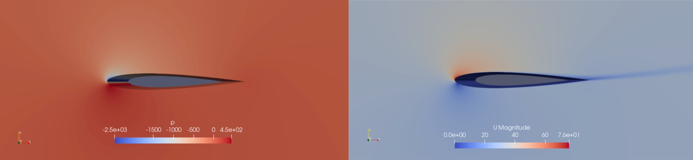
  <br><em>NACA 0012 — Pressure field (left) | Velocity magnitude (right)</em>
</p>

<p align="center">
  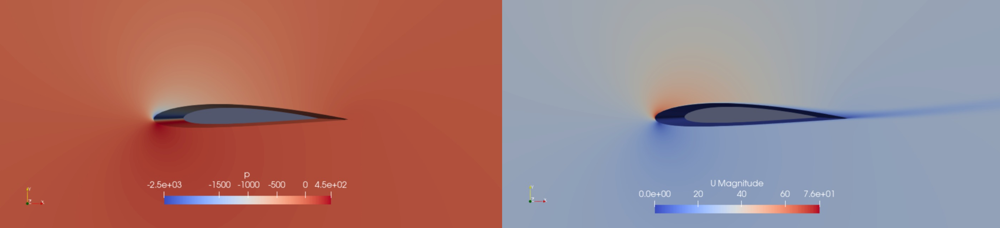
  <br><em>NACA 2412 — Cambered airfoil showing asymmetric flow distribution</em>
</p>

<p align="center">
  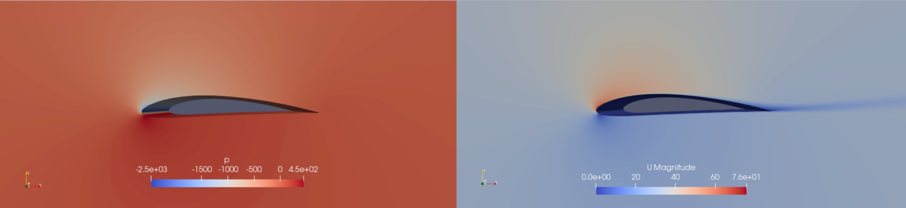
  <br><em>NACA 4412 — Higher camber producing stronger pressure differential</em>
</p>

## Results

### Model Comparison

Four approaches were benchmarked on the same airfoil data. PINN achieves the lowest MSE by leveraging physics constraints:

<p align="center">
  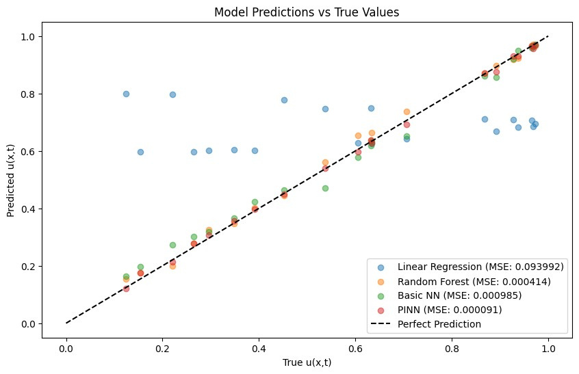
  <br><em>Predicted vs true values — PINN (MSE: 0.000091) closely follows the perfect prediction line</em>
</p>

| Model | MSE |
|-------|-----|
| Linear Regression | 0.093992 |
| Basic Neural Network | 0.000985 |
| Random Forest | 0.000414 |
| **PINN** | **0.000091** |

### Training Convergence

<p align="center">
  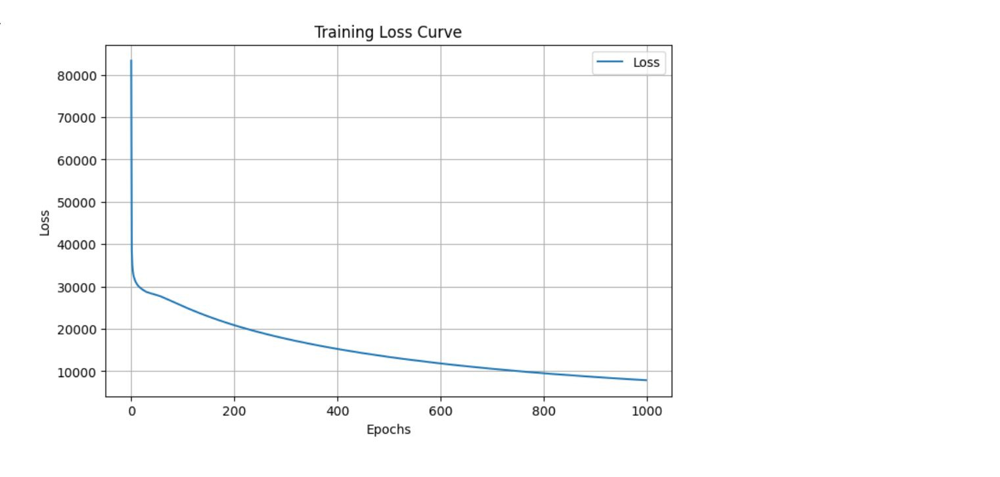
  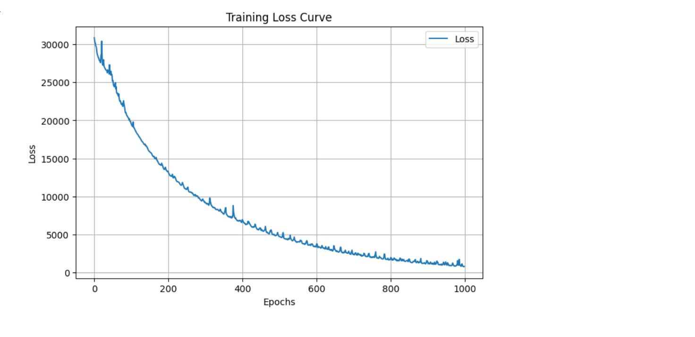
  <br><em>Left: Without physics loss (smooth but higher plateau) | Right: With physics loss (converges lower)</em>
</p>

## Streamlit App

An interactive web interface for uploading airfoil data, running automated EDA, training models, and visualizing flow fields:

- **Upload** — Load CSV/Excel airfoil simulation data
- **Profiling** — Automated exploratory data analysis with dataset statistics
- **Unpinned Data** — Raw data exploration and preprocessing
- **Piped Data** — PINN-powered flow field predictions with streamline and contour visualizations

> Demo video: [Google Drive](https://drive.google.com/file/d/1fhbdXtmCCAgKDjv0YCJm0bsM57_gkuyl/view?usp=sharing)

## Project Structure

```
AeroPINN/
├── Streamlit.py                          # Main Streamlit application
├── Dataset/
│   ├── 0012.csv, 0015.csv, 0021.csv      # Symmetric airfoils (NACA 00xx)
│   ├── 2412.csv, 2415.csv                # Cambered airfoils (NACA 24xx)
│   ├── 4412.csv                          # High-camber airfoil (NACA 4412)
│   └── *.png                             # CFD visualization snapshots
├── notebooks/
│   ├── comparining_model.ipynb           # Model training & comparison
│   └── preprocessing-missing-data.ipynb  # Data cleaning & imputation
├── src/
│   └── airfoil-cfd-model.ipynb           # Core PINN model development
├── asset/                                # Banner, workflow diagram, demo video
├── docs/                                 # Presentation slides
└── LICENSE
```

## Tech Stack

- **Deep Learning** — TensorFlow / Keras (PINN architecture)
- **Data Processing** — NumPy, Pandas, scikit-learn
- **Visualization** — Matplotlib, Seaborn, SciPy (griddata interpolation)
- **App** — Streamlit, ydata-profiling, PyCaret
- **CFD Data** — OpenFOAM simulation exports

## Getting Started

```bash
git clone https://github.com/sidd707/AeroPINN.git
cd AeroPINN
pip install -r requirements.txt
streamlit run Streamlit.py
```

## Team

- [Siddharth Patel](https://github.com/sidd707)
- [Sarthak Chauhan](https://github.com/CodeNinjaSarthak)
- [Rohan Singh](https://github.com/Roahn333singh)
- [Harish Sivakumar](https://github.com/HarishSivakumar)

## License

This project is licensed under the [MIT License](LICENSE).
